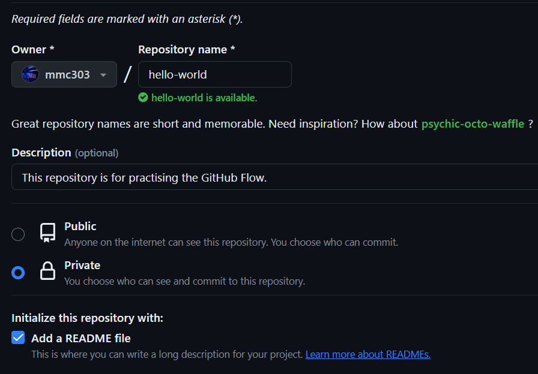
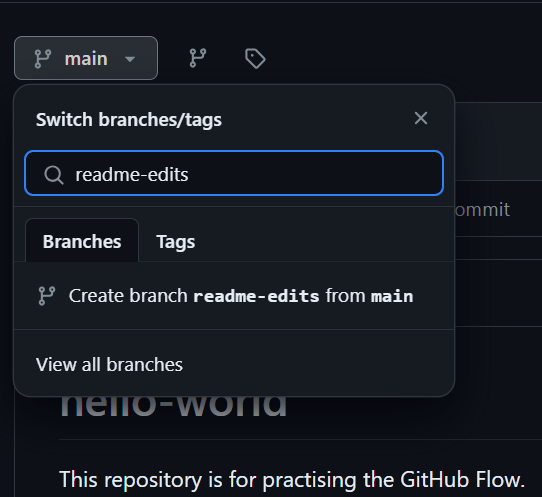
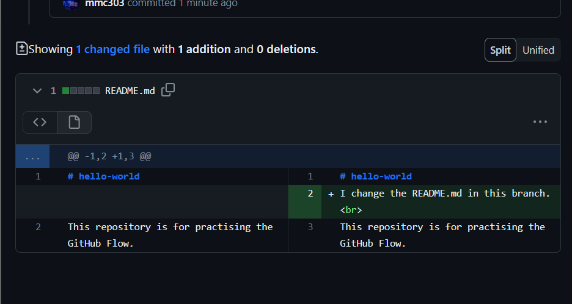
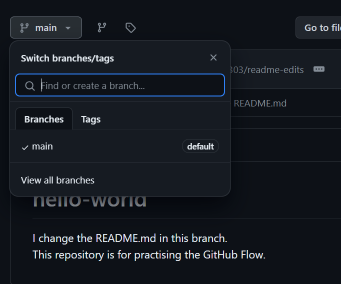
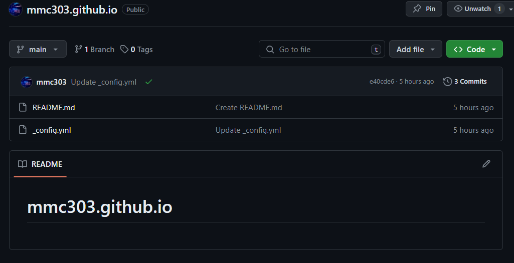
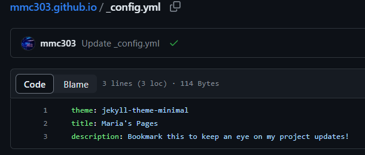

# HMIS - Sesion 03
## Maria Martinez Campos

### **1. GitHub Hello World** 
Se ha creado el repositorio.   
   
Se ha creado una rama nueva.   
   
Se ha modificado el README.md para despues hacer un pull request y merge.   
   
Y se ha eliminado la rama, teniendo el README.md de main actualizado.   
    

### **2. Getting Started with GitHub Pages**  
Se ha creado el repositorio con un README.md y un archivo _config.yml.   
   
El archivo _config.yml contiene una configuracion para editar los temas, titulos, descripciones o plugins para la pagina.   
   
Si en el buscador se dirige a ["mmc303.github.io"](#https://mmc303.github.io/) se encuentra la pagina creada con este repositorio.   

   

